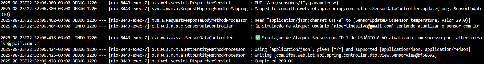
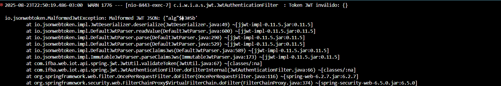
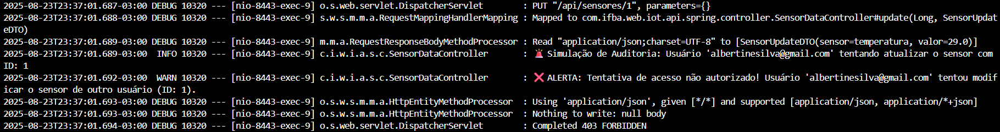
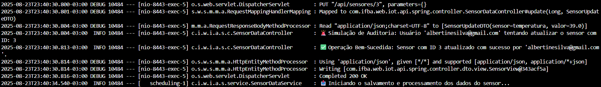

<h2 align="center">🌾Análise Crítica de Segurança em Painéis IoT</h2>

### Evidências e Análise Comparativa

Estes logs servem como prova de que a aplicação não só bloqueia tentativas indevidas, mas também processa corretamente as solicitações legítimas, demonstrando a robustez dos controles de acesso e a prevenção eficaz contra vulnerabilidades IDOR.

### Cenário 1: Antes da Segurança (Vulnerabilidade)

## 🔓 Evidência de Ataque Spoofing (IDOR) - Broken Access Control

Este log demonstra a exploração de uma vulnerabilidade de Controle de Acesso Quebrado (Broken Access Control).

- A requisição `PUT /api/sensores/1` foi enviada por um usuário autenticado (`albertinesilva@gmail.com`). No entanto, o sensor com `ID 1` não pertencia a ele.

- Os logs detalham a tentativa de atualização e confirmam o sucesso da operação (`✅ Sensor com ID 1 do USUÁRIO ALVO atualizado com sucesso...`). Isso prova que um usuário mal-intencionado conseguiu alterar dados de outro, configurando um ataque de `Spoofing` via IDOR (Insecure Direct Object Reference).

- A ausência de uma verificação de propriedade no código do endpoint permitiu que o usuário `albertinesilva@gmail.com` assumisse temporariamente a identidade e o controle de um recurso que não lhe pertencia, demonstrando a gravidade da falha.

### Cenário 2: Depois da Segurança (Proteção Ativa)

## 🚫 Log de Erro: Tentativa de Acesso com Token JWT Inválido

Este log demonstra o comportamento de segurança da aplicação ao receber um `JSON Web Token` (JWT) malformado. Ele confirma que o sistema está corretamente configurado para rejeitar requisições que não apresentem um token válido, protegendo os endpoints da API.

Detalhes do Erro

- A exceção principal, `io.jsonwebtoken.MalformedJwtException`, indica que a biblioteca de `JWT` não conseguiu decodificar o token. A mensagem de erro específica, Malformed `JWT JSON`, aponta para um problema na estrutura do token, onde caracteres inesperados (como o $ no exemplo) foram encontrados.

## 🛡️🚫 Evidência de Bloqueio de Tentativa de Acesso Não Autorizado (IDOR)

Este log mostra que a sua defesa contra acessos indevidos funcionou perfeitamente. Um usuário (albertinesilva@gmail.com) tentou alterar os dados de um sensor (ID: 1) que não era dele. A sua lógica de segurança, que impede o ataque IDOR (Insecure Direct Object Reference), percebeu que o usuário logado não tinha permissão para essa ação. Por isso, a tentativa foi negada, e o sistema respondeu com um erro 403 Forbidden. Isso prova que a proteção dos dados está ativa e segura.

## ✅ Log de Segurança: Operação Autorizada e Bem-Sucedida

O log de auditoria a seguir demonstra uma operação de atualização de sensor bem-sucedida e autorizada, confirmando que os mecanismos de defesa contra `IDOR` permitem o acesso a recursos apenas para usuários com as permissões corretas.

Análise do Log
- Tentativa de Acesso (Linha 5): O usuário `albertinesilva@gmail.com` tenta atualizar o sensor com ID: 3. A aplicação registra este evento como parte de sua auditoria de segurança (`Simulação de Auditoria`).

- Autorização e Execução (Linha 6): Após a verificação de autorização, o mecanismo de defesa permite a operação. A mensagem `✅ Operação Bem-Sucedida` confirma que a solicitação foi validada e o sensor foi atualizado com sucesso.

- Confirmação do Servidor (Linha 10): A operação é finalizada com um status `200 OK`, indicando que a requisição foi processada sem erros e o recurso (o sensor) foi modificado conforme o esperado.

Este log serve como prova de que a aplicação não só bloqueia tentativas indevidas, mas também processa corretamente as solicitações legítimas, demonstrando a robustez dos seus controles de acesso e a prevenção eficaz contra vulnerabilidades IDOR.

## 

Isso demonstra que a aplicação não só bloqueia tentativas indevidas, mas também processa corretamente as solicitações legítimas, reforçando a robustez dos controles de acesso e a prevenção eficaz contra vulnerabilidades IDOR.

1 - Impacto dos Ataques na Arquitetura

Ciberataques podem comprometer seriamente o desempenho e a confiabilidade de um sistema IoT. A seguir, detalhamos o impacto de ataques comuns na nossa arquitetura de painel de monitoramento:

- **Ataques de Negação de Serviço (`DDoS`):** O objetivo é sobrecarregar o servidor com um alto volume de requisições.

- **Latência:** Aumenta drasticamente. O tempo de resposta do servidor se eleva, tornando o painel lento ou inacessível.

- **Perda de Pacotes:** Aumenta significativamente. O sistema não consegue processar todas as requisições, resultando em dados de sensores sendo descartados ou não recebidos.

- **Falhas de Autenticação:** Pode ocorrer um aumento nas falhas de login. A sobrecarga impede o servidor de processar corretamente as credenciais, levando a timeouts ou erros de conexão.

**Ataques de Força Bruta e Credential Stuffing:** Focados em adivinhar senhas para obter acesso não autorizado.

- Falhas de Autenticação: Aumentam exponencialmente. O servidor gasta recursos consideráveis tentando processar milhares de tentativas de login inválidas.

- Recursos do Servidor: Aumenta a carga da `CPU` e da memória. Isso pode levar a um desempenho geral mais lento, impactando a latência para usuários legítimos.

**Ataques Man-in-the-Middle (MITM):** O atacante intercepta a comunicação entre o dispositivo e o servidor.

- Perda de Pacotes e Integridade de Dados: O atacante pode modificar, corromper ou descartar pacotes de dados. Os dados de sensores exibidos no painel podem ser falsos ou incompletos.

- Falhas de Autenticação: Credenciais podem ser roubadas, permitindo que o atacante se autentique como um usuário legítimo no futuro.

2 - Comparativo: Antes e Depois dos Mecanismos de Segurança

A implementação de mecanismos de segurança muda fundamentalmente a resiliência do sistema. Utilizando os logs fornecidos, podemos comprovar essa diferença:

Cenário 1: Antes da Segurança (Vulnerabilidade)

- Ataque `IDOR` (Insecure Direct Object Reference): O log de ataque mostra que um usuário autenticado (`albertinesilva@gmail.com`) conseguiu, através de uma simples alteração na URL (`PUT /api/sensores/1`), modificar um sensor que não pertencia a ele.

**Impacto:**

- **Falha de Autenticação:** A verificação de permissão falhou completamente. O sistema apenas validou que o usuário estava logado, mas não verificou se ele era o proprietário do recurso.

- **Integridade de Dados Comprometida:** A operação de atualização foi bem-sucedida, o que significa que um invasor poderia alterar dados de outros usuários. Isso também é uma falha grave na segurança da arquitetura.

Cenário 2: Depois da Segurança (Proteção Ativa)

- Bloqueio de Tentativa de IDOR: O log de defesa demonstra que a mesma tentativa de ataque agora é bloqueada. O sistema verifica a propriedade do sensor e nega a operação, retornando um erro `403 Forbidden`. Isso prova que o controle de acesso está funcionando, protegendo os recursos dos usuários.

- Validação de `Token JWT`: Outro log evidencia que o sistema rejeita requisições com tokens malformados (`io.jsonwebtoken.MalformedJwtException`), garantindo que apenas solicitações com autenticação válida e estruturada possam acessar a `API`.

- **Operação Autorizada:** O log de auditoria confirma que, quando um usuário tenta modificar um recurso que realmente pertence a ele (`albertinesilva@gmail.com` tenta atualizar o sensor com ID 3), a operação é validada e executada com sucesso (200 OK).

3 - Boas Práticas de Segurança: LGPD e InteliIoT

Para construir um sistema verdadeiramente seguro e em conformidade, é crucial seguir boas práticas baseadas em modelos e regulamentações:

**Princípios da LGPD (Lei Geral de Proteção de Dados):**

- **Minimização de Dados:** Coletar apenas os dados estritamente necessários para o funcionamento do painel. Excluir informações pessoais que não são relevantes para o objetivo principal.

- **Segurança e Integridade:** Utilizar criptografia robusta (como `HTTPS` e `SSL/TLS`) para garantir a confidencialidade e integridade de todos os dados sensíveis transmitidos.

- **Acesso Restrito:** Implementar o controle de acesso baseado em papéis (`RBAC`), garantindo que apenas usuários autorizados possam visualizar ou modificar determinados dados.

- **Relatório de Impacto à Privacidade (DPIA):** Avaliar proativamente os riscos de segurança para os dados, antes de lançar o sistema em produção.

**Modelo de Referência InteliIoT:**

Segurança no Design: A segurança deve ser uma consideração desde a fase de projeto, não apenas um recurso adicionado no final. Isso inclui a arquitetura segura do backend e o design do frontend.

- **Autenticação e Autorização:** Utilizar mecanismos de autenticação fortes (como `JWT`) e aplicar o princípio do menor privilégio, onde os usuários e dispositivos têm acesso apenas aos recursos de que precisam para funcionar.

- **Atualizações Seguras:** Garantir que o sistema possa ser atualizado de forma segura, evitando a instalação de código malicioso através de canais não confiáveis.

- **Zero Trust (Confiança Zero):** Assumir que nenhuma entidade (usuário, dispositivo, servidor) é confiável por padrão. Cada requisição deve ser validada e verificada, independentemente de sua origem.
