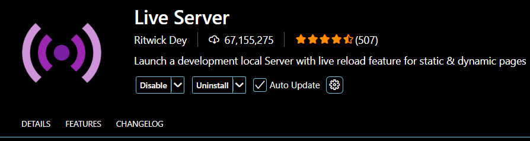
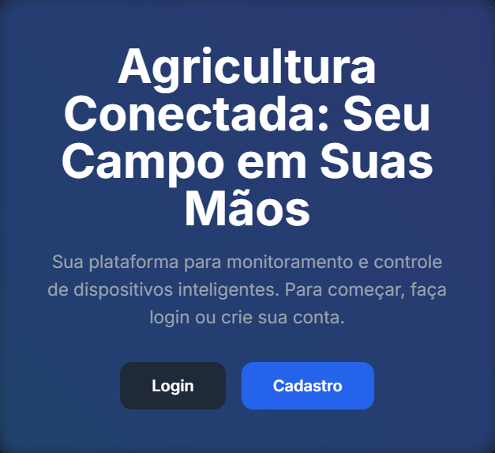
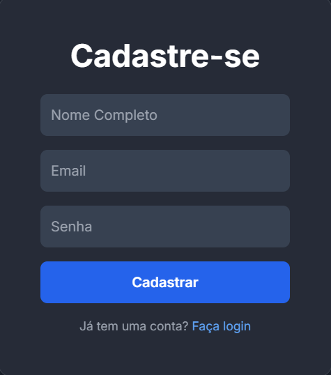
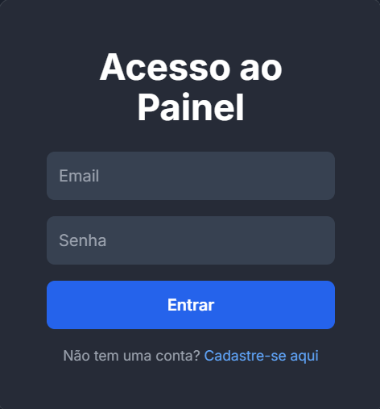
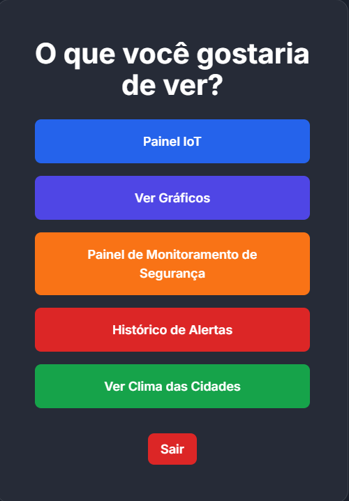
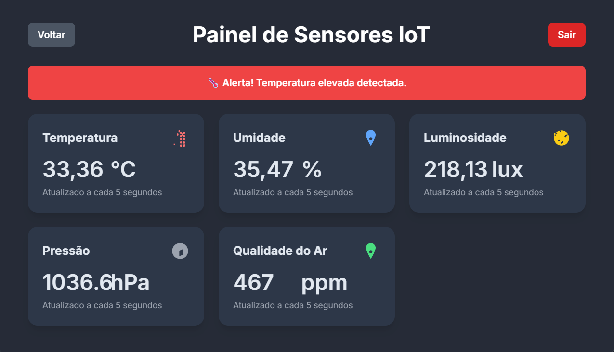
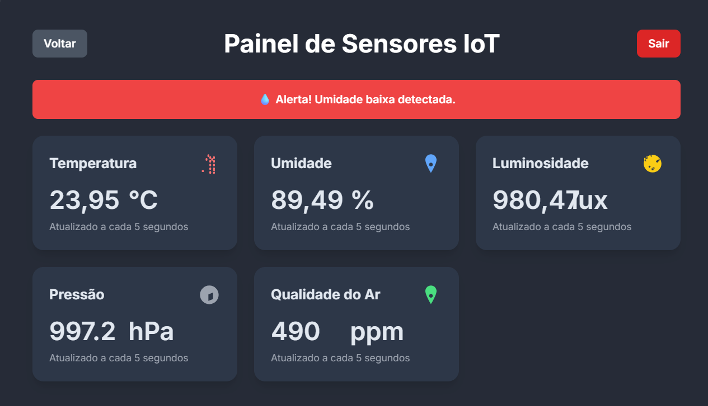
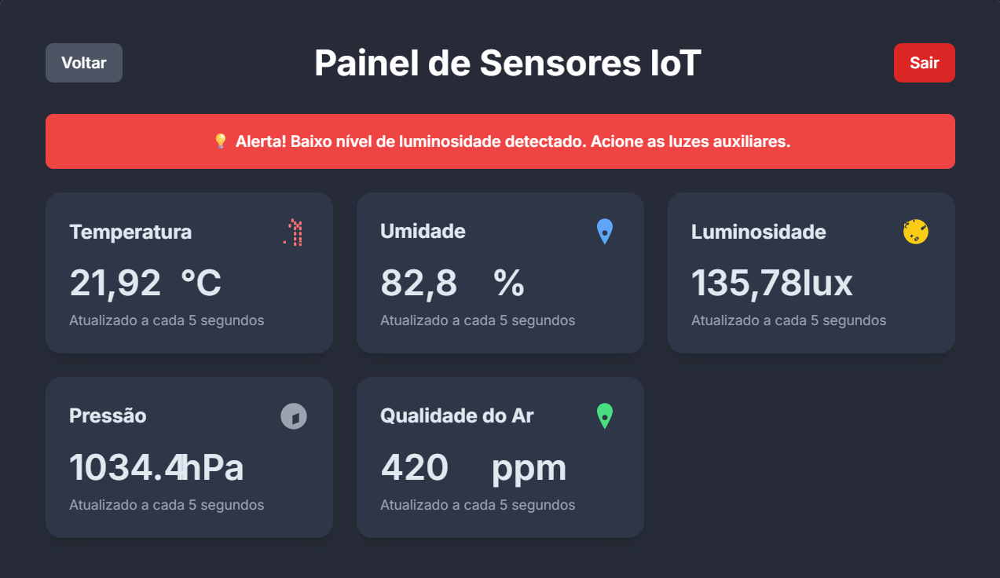
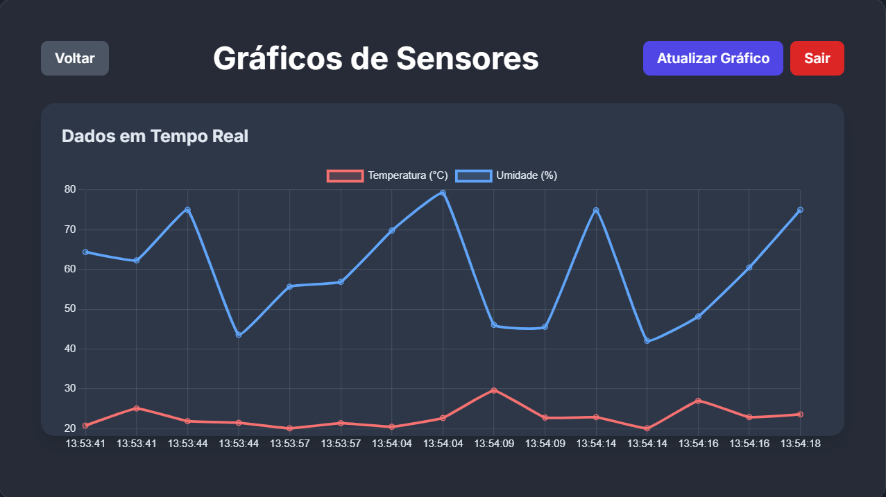

<h2 align="center">🌾Frontend IoT Simulado Protocolos para Agricultura Inteligente com Spring Boot</h2>

Este documento detalha o funcionamento e a interface de usuário do ***frontend***, que se comunica com o backend ***Spring Boot*** para monitorar dados de sensores agrícolas. O frontend é construído com ***JavaScript*** puro e utiliza a `API fetch` para consumir os dados em tempo real.

---
### Como Rodar a Aplicação

Para executar a aplicação frontend, você precisará da extensão `Live Server` instalada no seu editor de código Visual Studio Code:

- Abra a pasta do projeto no `VS Code`.

- Clique com o botão direito do mouse no arquivo `home.html`.

- Selecione a opção "`Open with Live Server`".

O **Live Server** irá iniciar um servidor local e abrir a página no seu navegador padrão, permitindo que o `frontend` faça as requisições para o `backend`.

---

### Telas do Sistema

#### Telas `Home`, `Cadastro` e `Login`.

  

  

  

  

  

---
#### Tela de `Escolha`.

A tela de escolha é o ponto de partida. Ela permite para onde ir dentro do aplicativo.

---
#### Telas de alertas de `Temperatura`, `Umidade` e `Luminosidade`.

🌡️ `Temperatura Acima de 30 ºC`

---
💧 `Umidade Abaixo de 100,00 %`

---
💡 `Luminosidade Abaixo de 200,00 Lux`

---
### Tela de Gráfico

Visualização de Dados com `Gráficos`

---
