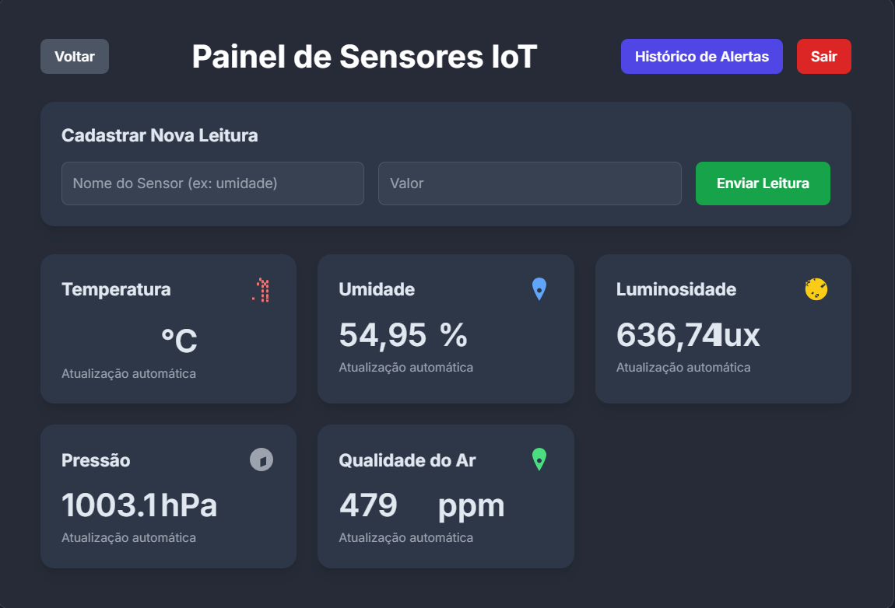
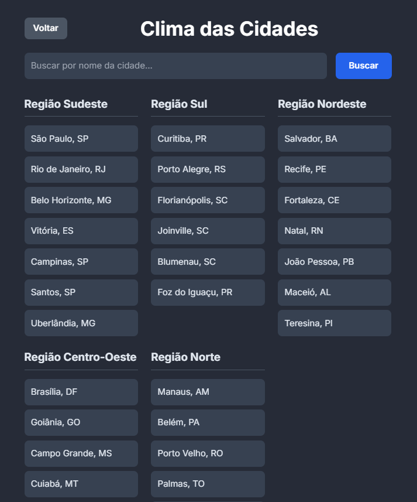
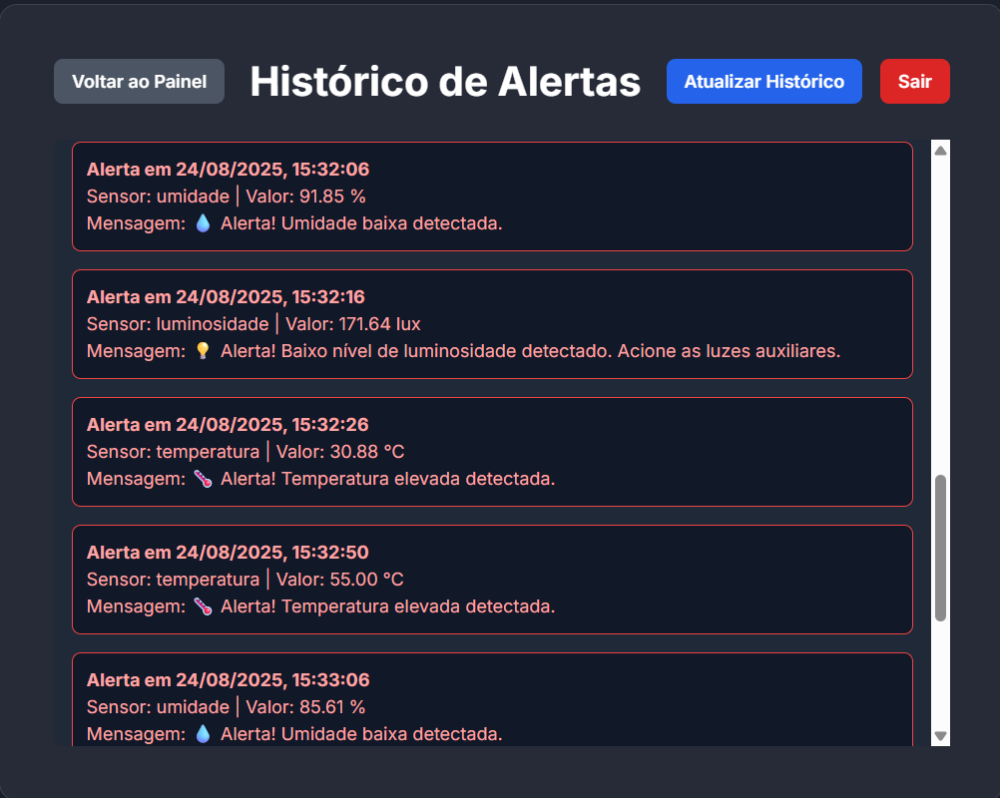

<h2 align="center">🌾Frontend IoT Simulado Protocolos para Agricultura Inteligente com Spring Boot</h2>

Este documento detalha o funcionamento e a interface de usuário do ***frontend***, que se comunica com o backend ***Spring Boot*** para monitorar dados de sensores agrícolas. O frontend é construído com ***JavaScript*** puro e utiliza a `API fetch` para consumir os dados em tempo real.

---
### Como Rodar a Aplicação

Para executar a aplicação frontend, você precisará da extensão `Live Server` instalada no seu editor de código Visual Studio Code:

- Abra a pasta do projeto no `VS Code`.

- Clique com o botão direito do mouse no arquivo `home.html`.

- Selecione a opção "`Open with Live Server`".

O **Live Server** irá iniciar um servidor local e abrir a página no seu navegador padrão, permitindo que o `frontend` faça as requisições para o `backend`.

---

### Telas do Sistema

#### Telas `Home`, `Cadastro` e `Login`.

  

  

  

  

  

---
#### Tela de `Escolha`.

A tela de escolha é o ponto de partida. Ela permite para onde ir dentro do aplicativo.

---
#### Telas de alertas de `Cadastro/Sensor`, `Temperatura`, `Umidade` e `Luminosidade`.

🍃 `Cadastro de Sensor`

🌡️ `Temperatura Acima de 30 ºC`

---
💧 `Umidade Abaixo de 100,00 %`

---
💡 `Luminosidade Abaixo de 200,00 Lux`

---
### 📈 Tela de `Gráfico`

Visualização de Dados com `Gráficos`

---
### ☀️ 🌧️ Tela de Clima das `Cidades`

A tela de `clima` permite que o usuário pesquise as condições `meteorológicas` de qualquer `cidade`. É possível usar os botões pré-definidos para cidades populares ou digitar o nome da cidade desejada e buscar.

---

### 📅 Tela de Historico de Sensores

---

### ✅ Conclusão e Aprendizados

Este projeto demonstra não apenas a capacidade de construir uma interface de usuário responsiva e intuitiva, mas também destaca a importância da comunicação entre o `frontend` e o `backend`. Através do uso de `JavaScript` puro e da `API fetch`, foi possível criar um painel de monitoramento em tempo real que simula um ambiente de agricultura inteligente, consumindo dados de `sensores` e apresentando-os de forma clara para o usuário.

A experiência de desenvolver este sistema reforça o conhecimento sobre a `arquitetura` de aplicações web, o tratamento de dados `assíncronos` e a visualização de informações, elementos cruciais para o desenvolvimento de soluções `IoT`.

---
| 🌎 LinkedIn                                                              | 👨‍💻 **Autor**                                                                 |
| ------------------------------------------------------------------------ | ---------------------------------------------------------------------------- |
| [LinkedIn](https://www.linkedin.com/in/albert-backend-java-spring-boot/) | [Albert Silva](https://www.linkedin.com/in/albert-backend-java-spring-boot/) |

