<h1 align="center">📸 Exibição de Resultados e Logs</h1>

Esta seção apresenta imagens capturadas de logs que comprovam o funcionamento dos endpoints e a integração com `RabbitMQ`.

## ⚙️ Configuração da Mensageria (MQTT e AMQP)

Este log de inicialização detalha a configuração bem-sucedida dos componentes de mensageria da aplicação. Ele confirma que o sistema está pronto para interagir com o `broker RabbitMQ`, com a criação da fila `iot-queue` e do `iot-exchange`, e também com o `broker MQTT` (em `localhost`), onde se conecta e se inscreve para receber mensagens do tópico `dados/sensores/local1`. Esses eventos atestam que a aplicação está totalmente operacional para a comunicação e o processamento de dados de sensores.

## 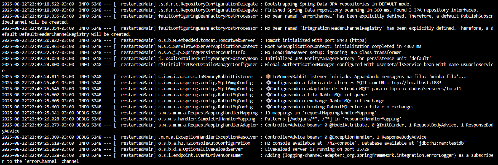

## 🔄 Análise do Processamento de Dados MQTT

Este log detalha o ciclo completo de uma mensagem, desde a sua origem até a tentativa de processamento final. Ele comprova a funcionalidade da sua arquitetura, ao mesmo tempo que aponta um ponto de melhoria no tratamento dos dados.

- **Mensagem MQTT Recebida:** A aplicação escutando o tópico `dados/sensores/local1` recebe a mensagem (`{temperatura: 35.5}`) enviada pelo comando `mosquitto_pub`. Isso demonstra que a sua aplicação está corretamente conectada ao `broker MQTT` e pronta para receber dados externos.

- **Redirecionamento com Sucesso:** A ponte (`MqttAmqpBridgeService`) encaminha a mensagem recebida do `MQTT` para o `RabbitMQ` sem nenhum problema. Esta etapa valida que a comunicação entre os dois protocolos de mensageria está funcionando perfeitamente.

- **Falha de Desserialização:** O erro ocorre no serviço de consumo de mensagens (`AmqpConsumerService`), que tenta converter o `payload` (`{temperatura: 35.5}`) de uma string para um objeto `JSON`. A conversão falha porque, no formato JSON, as chaves (ex: temperatura) precisam estar entre aspas duplas, como `"temperatura"`.

- **Validação da Comunicação:** O log comprova que a arquitetura de comunicação entre `MQTT` e `RabbitMQ` está funcional. A falha é na etapa de validação e processamento da mensagem, o que destaca a importância de garantir que o formato dos dados recebidos esteja sempre correto.

## 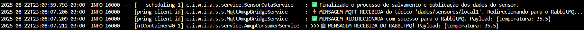

📦 Fluxo de Mensagens Completo (Simulado)

## 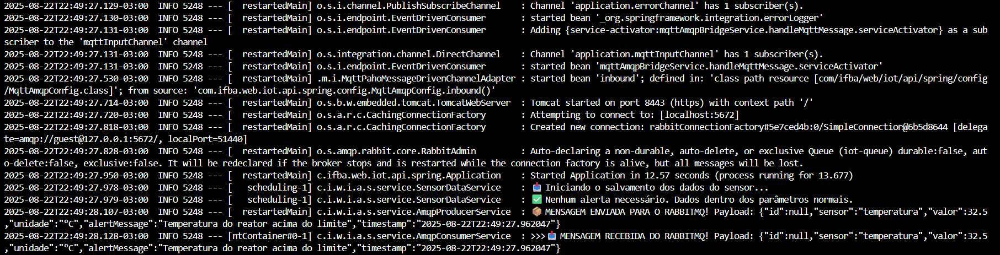

## 📋 Listagem de Sensores

Visualização dos sensores simulados retornados pelo endpoint `GET /sensores`.

## 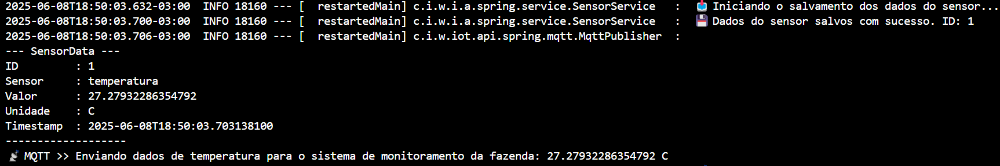

## 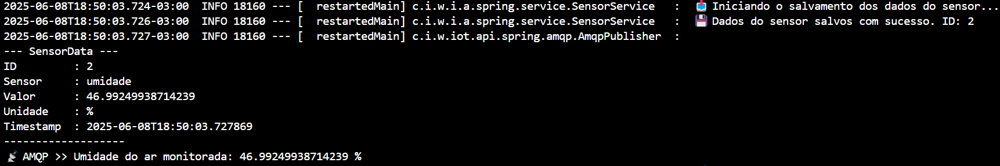

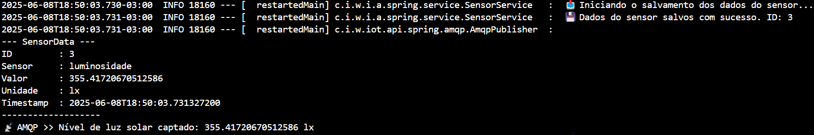

---
## 🚨 Registro de Alertas

Exemplo de envio de dados de alerta via POST /alerta e resposta do servidor.

## 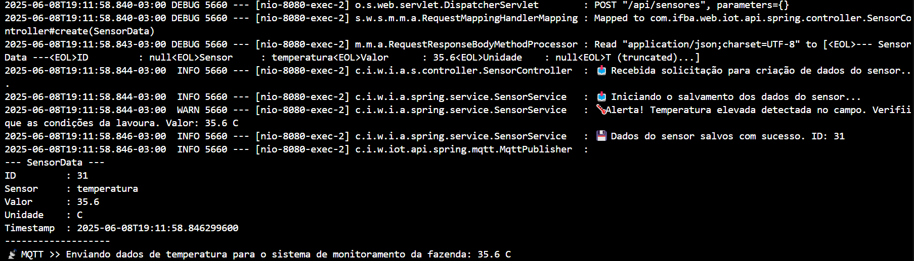

## 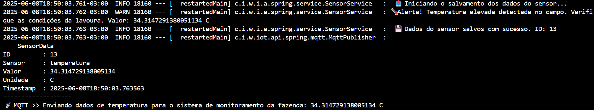

---
## 🐇 Comunicação com RabbitMQ

Confirmação de que os dados foram enviados para a fila RabbitMQ com sucesso.

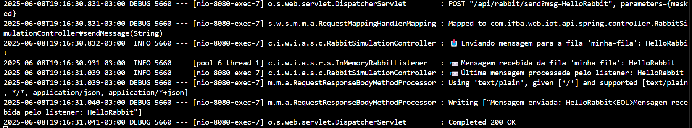

---

## Consumo pelo serviço, com evidências de cada etapa

### Temperatura acima de 30
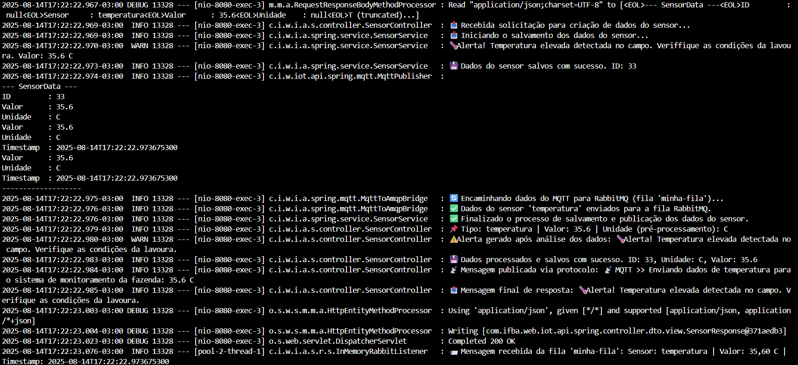

---

### Temperatura abaixo de 30
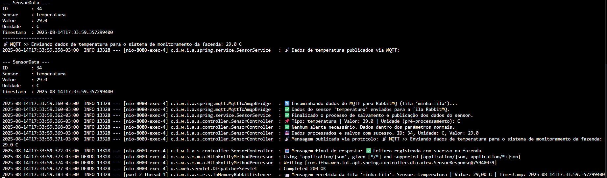  

---

| 🌎 LinkedIn                                                              | 👨‍💻 **Autor**                                                                 |
| ------------------------------------------------------------------------ | ---------------------------------------------------------------------------- |
| [LinkedIn](https://www.linkedin.com/in/albert-backend-java-spring-boot/) | [Albert Silva](https://www.linkedin.com/in/albert-backend-java-spring-boot/) |
